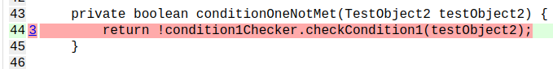

# Pitest bug minimal reproduction - Mockito's UnnecessaryStubbingException never triggered

1) Use `mvn clean verify` to trigger Pitest analysis.
2) Navigate to `target/pit-reports/index.html`
3) Open `TestObjectHandler` report.
4) Notice that Pitest shows surviving mutants which are not reproducible manually, as they all throw 
   `UnnecessaryStubbingException`:  

